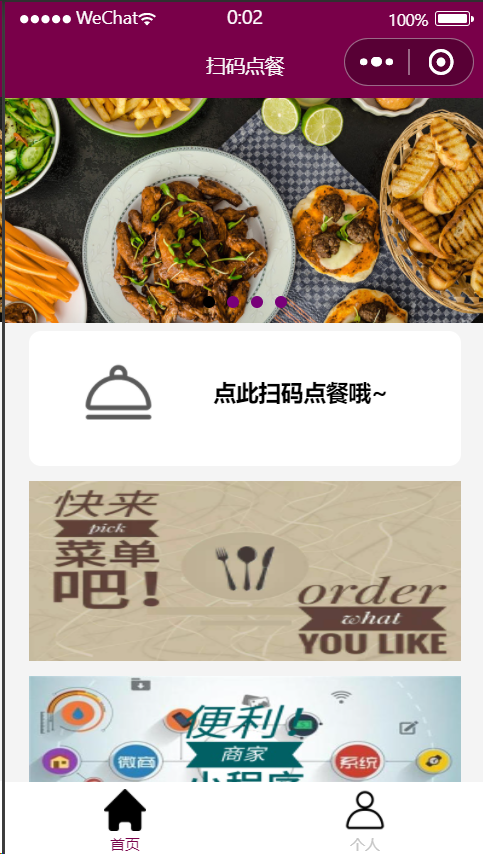
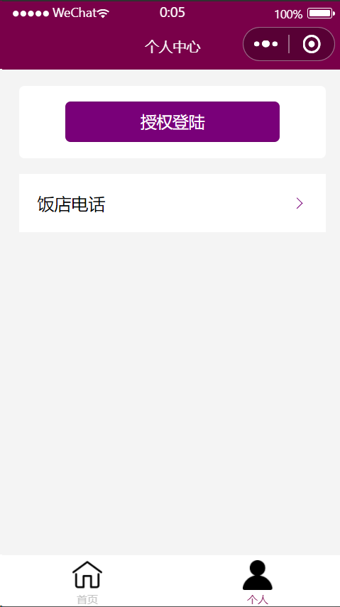
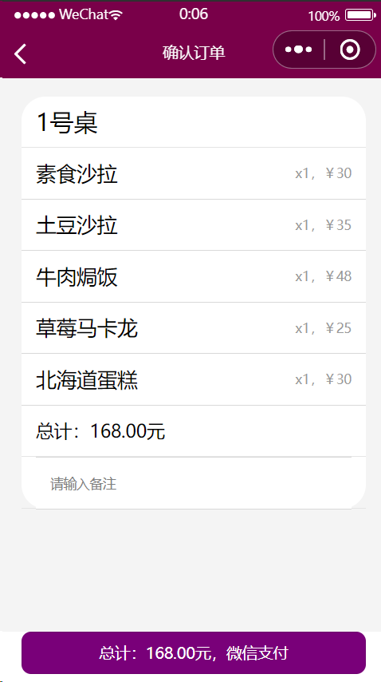
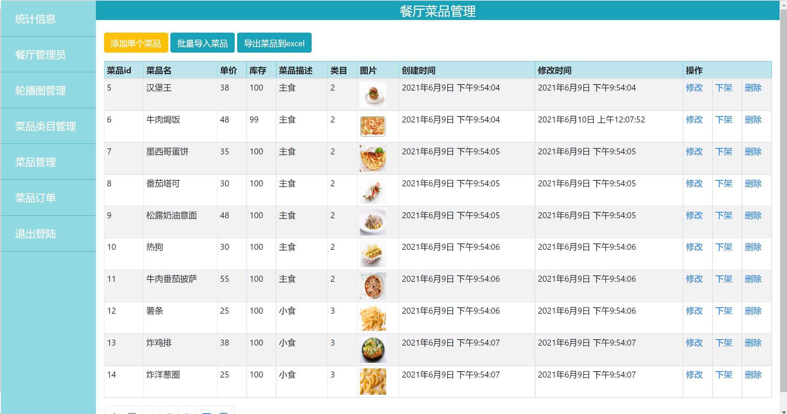

## Order Applet

> 点餐小程序，北航软院大二面向对象大作业

### 项目结构

本项目使用 SprintBoot 开发后端，微信开发平台开发小程序。

```python
.
├─data              # 菜品类目、商品、轮播图等数据资源
├─pages             # 页面展示
├─springboot        # 后端框架
├─xiaochengxu       # 小程序代码
└─README.md
```

### 项目功能

- [x] 小程序点餐
- [x] 用户订单查看
- [x] 菜品评价
- [x] 轮播图展览
- [x] 后台管理
- [ ] 支付功能

### 如何使用

需要根据情况修改下列配置：

- xiaochengxu\app.js

```js
globalData: {
    userInfo: {},
    openid: null,
    // baseUrl: 'http://localhost:8080/diancan'     //本地调试
    baseUrl: 'http://111.111.111.11:8080/diancan'   //真机调试,这里的ip地址需要修改为你服务器的IP
  },
  onLaunch: function () {
    wx.cloud.init({
      env: 'cloud2-5111111111111ff5',   //修改为你的云开发环境ID
      traceUser: true,
    })
    this.getOpenid();
  },
```

- springboot\src\main\java\com\example\demo\global\GlobalConst.java

```java
public interface GlobalConst {
    String COOKIE_TOKEN = "huangzehuan";    //用来管理Cookie的key

    String APPID="wx111111111111111";       //小程序的appID
    String APPSECRET = "111112db3139b05937bdea1111113f1";   //小程序的appsecret，记得换成你自己的

}
```

- springboot\src\main\resources\application.yml

```yml
spring: # 注意此处数据库设置可能需要根据情况进行修改
  datasource:
    url: jdbc:mysql://localhost:3306/oms?characterEncoding=utf-8&useSSL=false&serverTimeZone=UTC
      &useOldAliasMetadataBehavior=true&allowPublicKeyRetrieval=true
    username: root
    password: password
```

### 关于部署

> 这部分还没实践,实操之后再来补充

### 页面展示










