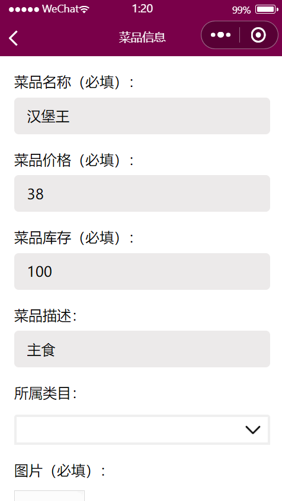

## Order Applet

> 点餐小程序，北航软院大二面向对象大作业

仓库地址：https://github.com/ZewanHuang/Order-Applet

### 项目结构

本项目使用 SprintBoot 开发后端，微信开发平台开发小程序。

```python
.
├─data              # 菜品类目、商品、轮播图等数据资源
├─pages             # 页面展示
├─springboot        # 后端框架
├─xiaochengxu       # 小程序代码
└─README.md
```

### 项目功能

- [x] 小程序点餐
- [x] 用户订单查看
- [x] 菜品评价
- [x] 轮播图展览
- [x] 后台管理
- [ ] 支付功能

### 页面展示


